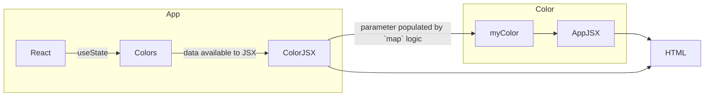
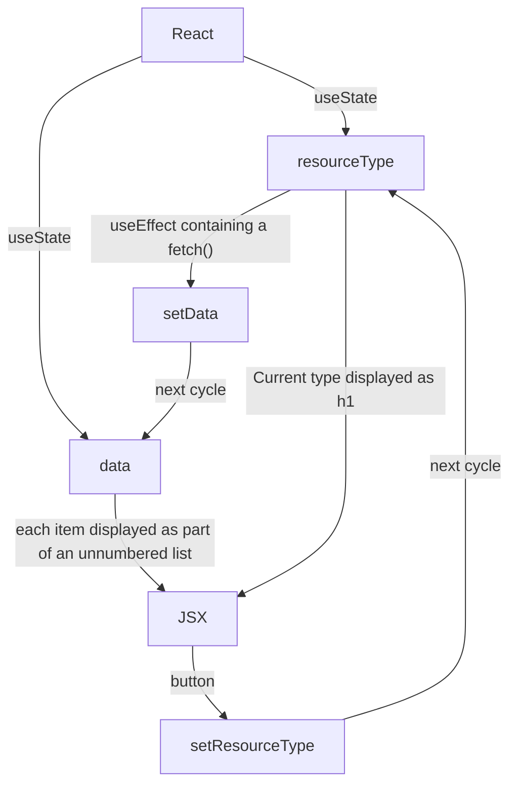

# React_Examples
# React_Examples
Small React Project Examples

# useeffect

```mermaid
graph LR
ColorJSX-->|"parameter populated by `map` logic"|myColor
subgraph Color
myColor-->AppJSX
end
subgraph App
React-->|useState|Colors
Colors-->|"data available to JSX"|ColorJSX
end
AppJSX-->HTML
ColorJSX-->HTML

```

#
#
#

```mermaid
graph TB
React-->|useState|resourceType
React-->|useState|data
resourceType-->|"useEffect containing a fetch()"|setData
setData-->|next cycle|data
JSX-->|button|setResourceType
data-->|each item displayed as part of an unnumbered list|JSX
resourceType-->|Current type displayed as h1|JSX
setResourceType-->|next cycle|resourceType
```